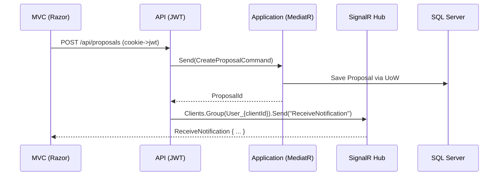

# Architecture

This document describes the architecture, patterns, and flows used in the FreelanceJobBoard solution.

## High-level overview

```
+-----------------------------+            +-----------------------------+
|  Presentation (MVC)         |  HttpClient|  API (REST)                 |
|  - Razor Views              +----------->|  - Controllers (JWT)        |
|  - Cookie Auth              |            |  - Middlewares (Serilog)    |
|  - SignalR Client           |            |  - SignalR (NotificationHub)|
+--------------+--------------+            +--------------+--------------+
               |                                        |
               |                                        |
               v                                        v
         +-----+-------------------------------+  +-----+------------------+
         | Application (CQRS + MediatR)       |  | Infrastructure         |
         | - Commands/Queries/Handlers        |  | - EF Core (DbContext)  |
         | - Validation/Behaviors             |  | - Repositories/UoW     |
         | - Interfaces (Services)            |  | - Cloudinary/Email     |
         +----------------+-------------------+  +------------------------+
                              |                           |
                              +--------- Domain ----------+
                                        - Entities
                                        - Value Objects
                                        - Constants
```

Key projects
- src/FreelanceJobBoard.Presentation — ASP.NET Core MVC (Razor Views), Cookie auth, HttpClient to API, SignalR client
- src/FreelanceJobBoard.API — ASP.NET Core Web API, JWT auth, Serilog, custom middlewares, SignalR hub
- src/FreelanceJobBoard.Application — CQRS + MediatR, business logic, DTOs, validators
- src/FreelanceJobBoard.Infrastructure — EF Core, repositories + UnitOfWork, integrations (Cloudinary, Email)
- src/FreelanceJobBoard.Domain — domain entities and constants

## Technology selections
- .NET 8, ASP.NET Core MVC (Razor Views) and Web API
- Entity Framework Core (SQL Server)
- SignalR for realtime notifications
- Serilog for structured logging
- JWT (API) + Cookies (MVC) authentication
- Cloudinary for file storage
- xUnit, Moq, FluentAssertions for testing

## CQRS & MediatR
- Commands and Queries are defined under Application/Features/*
- Handlers implement IRequestHandler<TRequest, TResponse>
- Validation and cross-cutting behaviors are applied in the Application layer (e.g., ValidationBehavior)

Benefits
- Separation of reads/writes, testability, and clear handler responsibilities

## Unit of Work and Repositories
- IUnitOfWork coordinates repository access and SaveChangesAsync across aggregates
- Repositories encapsulate EF Core queries; DbContext defined in Infrastructure

## Authentication & Authorization
- API: JWT Bearer configured via JwtSettings in appsettings
- MVC: Cookie auth with Identity; roles: Admin, Client, Freelancer
- CORS policy allows MVC origin to call API

## SignalR realtime notifications
- Hub: NotificationHub (/hubs/notifications)
- On connect: user is added to User_{userId} group
- Server can push to specific users or broadcast to groups

Sequence (Job -> Notification)



## Middlewares & logging
- ErrorHandlingMiddleware: centralized exception handling in API
- RequestResponseLoggingMiddleware: request/response auditing with correlation and performance metrics
- Serilog sinks: Console + File; enrichers include environment name and thread id (and correlation id in MVC)

## Configuration
- ConnectionStrings:DefaultConnection for EF Core SQL Server
- JwtSettings: { SecretKey, Issuer, Audience, ExpirationInHours }
- Cloudinary: { CloudName, ApiKey, ApiSecret }
- Serilog: Console and File sinks with rolling logs

## Diagrams
- You can generate richer diagrams with:
  - draw.io (export PNG/SVG to assets/)
  - Mermaid (supported in GitHub Markdown)

TODO
- Add a container diagram
- Add deployment diagram once Docker/Cloud infra is finalized
